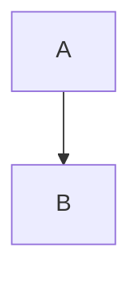

# MDAST+ Specification Proposal

**Version**: 0.2.3
**Status**: RFC (Request for Comments)
**Base**: `mdast` (unist)
**Scope**: 在不破坏 unist/mdast 生态兼容性的前提下，为 Markdown 文档引入“语义优先”的扩展约定，并给出可实现、可测试、可降级的规范。

## 1. 核心设计原则

1. **Superset（超集原则）**
    * **MUST**：保持 unist 结构与 mdast 基本语义兼容（`type`、`children`、`value`、`position` 等不被破坏）。常见遍历工具（如 `unist-util-visit`）应可无修改遍历扩展节点。
    * **SHOULD**：所有扩展语义都提供可预测的“降级策略”，使其能被 stringify/渲染器在不理解扩展的情况下输出合理 Markdown。
2. **Semantic-First（语义优先）**
    节点描述“它是什么”（例如 `callout`/`admonition` 的语义），而非“它长什么样”（例如某种颜色的盒子）。
3. **Unified Extension（统一扩展）**
    * **MUST**：避免随意发明新节点类型。
    * **SHOULD**：优先使用 `Directive` 表达布局/组件类语义，使用 `code` 表达 DSL/黑盒载荷，使用 `data` 表达元信息与桥接信息。
4. **Strict Typing（严格类型）**
    * **MUST**：提供 TypeScript 类型定义与 module augmentation，保障转换管线类型安全。
5. **KISS**
    尽量复用现有 remark/rehype/unist/mdast 生态，避免重复造轮子。

### 1.1 选型提示

* 需要**编译/渲染**的（图表、数据）→ **`code`（按 `lang` 区分）**
* 需要**包装/排版**的（提示框、布局）→ **`directive`（container/leaf/text）**
* **Graceful Degradation（优雅降级）**
  * **MUST**：所有扩展结构都定义降级到“标准 Markdown 可表达结构”的方式。
  * 示例：mermaid 可降级为代码块或图片；callout 可降级为引用块。

---

## 2. 节点分类与定义 (Node Taxonomy)

mdast+ 将节点分为三大类：**Core (核心) & Rich (富文本)**, **DSL (领域语言)**, **Component (组件)**。

### A. Core & Rich (基础与富文本)

*继承自 GFM 和常用 remark 插件规范，并对少量常用“行内样式”做扩展。*

| 节点类型 | 来源标准 | 语义 | 备注 |
| :--- | :--- | :--- | :--- |
| `table` / `tableRow` / `tableCell` | GFM | 表格 | **增强**: `data` 属性支持 `rowspan`, `colspan` |
| `delete` | GFM | 删除线 | `~~text~~` |
| `listItem` | GFM | 任务列表 | `checked: true/false/null` |
| `footnoteReference` / `footnoteDefinition` | GFM | 脚注 | `[^1]` |
| `image` | Common | 图片 | 尺寸存入 `data.hProperties` (见下文) |
| `math` / `inlineMath` | STEM | 数学公式 | 独立节点，不使用 Code 表达数学 |
| `mark` | Extension | 高亮 | `==text==` |
| `sub` / `sup` | Extension | 下标/上标 | `~text~` / `^text^` |

#### 2.A.1 为什么 `mark/sub/sup` 作为核心扩展节点

* 它们属于“行内样式（inline style）”，与 `strong/emphasis` 同层出现，放进 `directive` 会显著降低可读性与编辑体验。
* **MUST**：它们应当像其他 phrasing nodes 一样自然出现在段落内部（`PhrasingContent`）。

#### 2.A.2 图片尺寸约定

标准 Markdown 图片节点不含尺寸。mdast+ 约定：

* **MUST**：尺寸存入 `image.data.hProperties.width` / `height`
* **SHOULD**：优先使用数值（像素语义），例如 `width: 500`

> 与 mdast→hast 的桥接字段 `data.hProperties` 兼容性在生态中广泛存在。\[^mdast\]

#### 2.A.3 图片尺寸的 Markdown 输入语法（可选）

为支持 round-trip（AST ↔ Markdown），推荐解析/输出 Attribute Syntax（类 Pandoc/Kramdown 风格）。示例：

* `{width=500 height=300}`

实现 **MAY** 兼容变体：

* ``
* ``

规范化时 **MUST** 落到 `data.hProperties.width/height`。

### B. DSL & Figures (领域语言与图表)

*统一使用标准 `code` 节点，通过 `lang` 属性区分语义。*

**处理原则**：此类节点内容被视为 **Raw Payload**。转换器可调用特定引擎将其转换为 `image` 或 HTML 片段；同时必须保证可逆与安全（见 2.B.3）。

| 语言标识 (`lang`) | 语义类型 | 推荐处理策略 (Transformer) |
| :--- | :--- | :--- |
| `mermaid` | 流程/时序图 | Client-side 渲染 或 Kroki 输出 SVG |
| `plantuml` | UML 图 | Kroki 输出 SVG |
| `csv` | 表格数据 | 解析 CSV -> 转换为 `table` |
| `json` / `yaml` | 数据/配置 | 展示代码，或驱动特定可视化组件 |
| `latex` | 大段 LaTeX 源码 | 通常仅高亮显示(区别于 `math` 节点) |
| `geojson` | 地理数据 | 渲染为地图组件或图片 |

#### 2.B.1 AST 结构示例

```javascript
{
  type: 'code',
  lang: 'mermaid',
  meta: 'title="架构图"',
  value: 'graph TD; A-->B;'
}
```

#### 2.B.2 结构化 meta（推荐）

* **SHOULD**：在 Normalize 阶段把 `code.meta` 解析为结构化字段，例如 `code.data.title`、`code.data.filename` 等（见 4.3）。
* **MAY**：保留原始 `meta` 字符串用于 round-trip。

#### 2.B.3 安全性与可逆性

1. **逃生舱（_origin）**
    * **MUST**：当转换可能丢失细节时，将原始 payload 存入 `node.data._origin.raw`，并标注 `format`。
    * 例如 `mermaid` → `image` 时，把原始 mermaid 文本放进生成的 `image.data._origin.raw`。
2. **Sanitization**
    * **MUST**：任何从 DSL 生成的 HTML/SVG 都必须在输出前进行清洗（例如 `rehype-sanitize` 或等效机制），防止 XSS。[^sanitize]
    * **SHOULD**：若允许 SVG 输出，sanitize schema 需要显式考虑 SVG 属性白名单；否则建议将图形以安全的外链/资源方式引入（例如 ``）。

### C. Components & Layouts (组件与布局)

统一使用 `directive` 节点（container/leaf/text）。生态来源：`remark-directive` / `mdast-util-directive`。[^directive]

**命名规范**：

* **MUST**：canonical directive `name` 使用全小写。
* **MAY**：解析阶段支持别名与大小写混写，但 Normalize 后必须写回 canonical（见 4.1）。

#### 1. Container Directive (`:::name`)

用于块级容器，内部包含 Markdown 内容（children）。

| 指令名称 (`name`) | 语义 | 典型属性 (`attributes`) | 降级策略 |
| :--- | :--- | :--- | :--- |
| `note` / `tip` / `Important` / `Caution` /`warning` / `danger` | **Admonition** (提示块) | `title` | `blockquote` (引用) |
| `details` | **Collapsible** (折叠块) | `open` (bool), `summary` | 列表或纯文本 |
| `tabs` / `tab` | **Layout** (选项卡) | `label` | 顺序排列的标题+内容 |
| `grid` / `col` | **Layout** (网格) | `width` | 顺序排列 |

提示指令的详细说明:

| 级别 | 推荐 Emoji | 推荐颜色 | 适用场景 |
| --- | --- | --- | --- |
| **Note** (备注) | ℹ️ 或 📝 | **蓝色** (#209cee) | 补充背景信息、非必要的说明或引用。 |
| **Tip** (提示) | 💡 或 ✨ | **绿色** (#23d160) | 帮助用户更高效操作的小技巧或“避坑”经验。 |
| **Important** (重要) | ❗ 或 📌 | **青色/深蓝** (#118fe3) | 必须阅读的关键点，如果不看可能会导致操作失败。 |
| **Caution** (小心) | ⚠️ 或 🔸 | **黄色/橙色** (#ffdd57) | 提醒用户注意非破坏性的风险，如“此操作耗时较长”。 |
| **Warning** (警告) | 🟠 或 ⚠️ | **橙色** (#ff9500) | 存在潜在的中度风险，如“此操作不可撤销”或“数据将被覆盖”。 |
| **Danger** (危险) | 🚫 或 ❌ 或 💀 | **红色** (#ff3860) | 极高风险，可能导致严重后果、系统崩溃或安全威胁。 |

提示指令同时支持块级容器和单行内联（TextDirective）两种写法。

```md
::: warning 注意
请小心...
:::
```

**Canonical AST 示例（规范化后）**:

```javascript
{
  type: 'containerDirective',
  name: 'warning',
  attributes: { title: '注意' },
  children: [ // 内部包含标准 Markdown AST
    { type: 'paragraph', children: [{ type: 'text', value: '请小心...' }] }
  ]
}
```

单行内联: `:warning[请小心]{title="注意"}`

#### 2. Leaf Directive (`::name`)

用于独立组件（无 Markdown children）。

| 指令名称 (`name`) | 语义 | 典型属性 | 降级策略 |
| :--- | :--- | :--- | :--- |
| `youtube` / `bilibili` | **Embed** (视频) | `id` | 链接 (Link) |
| `toc` | **Meta** (目录) | `depth` | (移除) |
| `pagebreak` | **Print** (分页) | - | `---` (水平线) |

```md
::youtube[Label]{v=123}
```

**AST 结构示例**:

```javascript
{
  type: 'leafDirective',
  name: 'youtube',
  attributes: {v: '123'},
  children: [{type: 'text', value: 'Label'}]
}
```

#### 3. Text Directive（`:name[...]`）

用于行内组件或行内提示。规范化规则同样适用（title 进入 `attributes.title`，label 从 children 中剥离）。

## Directive 标题规范

AST 规范 (Canonical Representation):

* **MUST**: 所有 Directive 的“标题/显示名”统一落到 `attributes.title` 字段中。
* **Children**: `children` 应当只包含提示块的正文内容，**不应**包含标题文本。

**Markdown 输入语法 (Input Syntax)**:

* **Standard**: Attribute 写法 `:::warning{title="注意"}` (推荐，最清晰)。
* **Sugar**: Label 写法 `:::warning[注意]` 或 `:::warning 注意` (允许作为语法糖存在)。

**规范化逻辑 (Normalization Logic)**:
在 Parse 阶段之后，必须执行 **Title Normalization**：

1. **检测**: 检查 Directive 是否包含 Label (通常解析为 `children` 中的 `directiveLabel` 节点或特定的 Label 结构)。
2. **提取**:
    * 若 Label 内容为 **纯文本** (Text-only)，提取其字符串值。
    * 若 Label 包含 **简单格式** (如加粗 `[**Note**]`)，提取其纯文本内容 (strip formatting)。
3. **赋值**: 将提取的文本赋值给 `attributes.title`。
4. **清洗**: 从 `children` 中 **移除** 该 Label 节点，防止标题在正文中重复渲染。
5. **例外 (Exception)**:
    * 如果 Label 包含 **复杂内容** (如图片、公式)，则无法转换为简单的 string attribute。此时 **MAY** 保留 Label 节点，由渲染器特殊处理（但这被视为不规范的 Admonition）。

---

## 3. 通用数据协议（Universal Data Protocol）

### 3.1 资源模型（Assets）

用于支持“单文档 + 资源文件”的输出（HTML、Markdown + assets）。

- **MUST**：转换结果可携带 `assets`，用于落盘或打包。
- **SHOULD**：资源路径为相对路径，便于搬运与部署。

### 3.2 TypeScript 定义（推荐参考实现）

```ts
// mdast-plus.d.ts
import type { Root, Parent, PhrasingContent } from "mdast";
import type { Properties } from "hast";
import type {
  ContainerDirective,
  LeafDirective,
  TextDirective
} from "mdast-util-directive";

export type { Root } from "mdast";
export type { Properties } from "hast";
export type { ContainerDirective, LeafDirective, TextDirective } from "mdast-util-directive";

export type MdastAsset = {
  path: string;        // e.g. "assets/diagram-1.svg"
  contentType: string; // e.g. "image/svg+xml"
  bytes: Uint8Array;
};

export type MdastConvertResult = {
  tree: Root;                 // mdast+ tree
  assets: MdastAsset[];
};

export interface MdastReader<I> {
  read(input: I): Promise<Root>;
}

export interface MdastTransformer {
  transform(tree: Root): Promise<{ tree: Root; assets?: MdastAsset[] }>;
}

export interface MdastWriter<O> {
  write(tree: Root, assets?: MdastAsset[]): Promise<O>;
}

// Inline style extensions
export interface MdastMark extends Parent {
  type: "mark";
  children: PhrasingContent[];
}
export interface MdastSub extends Parent {
  type: "sub";
  children: PhrasingContent[];
}
export interface MdastSup extends Parent {
  type: "sup";
  children: PhrasingContent[];
}

export interface MdastDataOrigin {
  format: "docx" | "notion" | "html" | "markdown" | "latex" | string;
  raw?: unknown;
  hash?: string;
  [k: string]: unknown;
}

declare module "mdast" {
  interface Data {
    // mdast->hast bridge
    hName?: string;
    hProperties?: Properties;

    // provenance / reversibility
    _origin?: MdastDataOrigin;

    // legacy/compat inputs; normalize into hProperties.{rowSpan,colSpan}
    rowspan?: number;
    colspan?: number;
  }

  interface PhrasingContentMap {
    mark: MdastMark;
    sub: MdastSub;
    sup: MdastSup;
  }
}
```

> `data.hProperties` / `data.hName` 属于生态中常见的 mdast→hast 桥接方式。[^mdast]
> directive 节点由 remark-directive 提供。[^directive]

---

## 4. Canonicalization & Compliance（规范化与一致性）

本节定义 **Parse 后必须执行** 的 Normalize 规则，以及推荐的 compliance fixtures（测试向量），用于保证不同实现输出一致。

### 4.1 Directive 规范化

#### 4.1.1 name 规范化

- **MUST**：将 directive `name` 规范为小写（`name = name.toLowerCase()`）。
- **MAY**：支持别名映射，例如 `error → danger`、`warn → warning`。
- **MUST**：normalize 后写回 canonical `name`。

#### 4.1.2 标题字段规范（Canonical Title）

**Canonical Representation**：

- **MUST**：所有 directive 的“标题/显示名”统一存入 `attributes.title`（字符串）。
- **MUST**：`children` 仅包含正文内容，不应包含标题文本。

**输入语法（Input Syntax）**：

- **Standard**：`:::warning{title="注意"}`（推荐）
- **Sugar**：`:::warning[注意]` 或 `:::warning 注意`（允许）

**Title Normalization 流程**（Parse 后执行）：

1. **检测**：判断是否存在 label（不同 parser 可能解析为 `directiveLabel` 节点或等价结构）。
2. **提取**：
   - 若 label 为纯文本或仅含简单格式（如强调/加粗），提取其纯文本（strip formatting）。
3. **赋值**：写入 `attributes.title = extractedText`（若已存在 title，**SHOULD** 以显式 `attributes.title` 优先）。
4. **清洗**：从 `children` 移除 label 节点，避免标题重复渲染。
5. **例外**：
   - 若 label 含复杂内容（图片、公式、链接嵌套等），**MAY** 保留 label 并由渲染器特殊处理；但此情况 **SHOULD** 被视为“不规范的 admonition”。

#### 4.1.3 Admonition 的降级模板（规范）

当输出目标不支持 directive（或用户要求降级）时：

- **MUST**：降级为 `blockquote`
- 标题存在时 **SHOULD** 使用以下结构：

```md
> **{title}**
>
> {content...}
```

标题不存在时：

```md
> {content...}
```

（标题前缀符号/图标属于表现层，本规范不强制。）

---

### 4.2 Table cell rowspan/colspan 规范化

#### 4.2.1 Canonical 存储位置

- **MUST**：使用 `tableCell.data.hProperties.rowSpan` 与 `tableCell.data.hProperties.colSpan`（注意 S 大写）。
- **SHOULD**：数值为正整数。

#### 4.2.2 Legacy 兼容

若解析器/上游生成了以下字段：

- `tableCell.data.rowspan` / `tableCell.data.colspan`

Normalize 时：

- **MUST**：迁移到 `hProperties.rowSpan/colSpan`
- **SHOULD**：删除 legacy 字段，避免双源不一致

---

### 4.3 Code meta 结构化规范化

对 `code.meta` 的结构化解析（例如 `title="架构图" filename="a.svg"`）：

- **SHOULD**：把可识别键值对解析到 `code.data`，例如：
  - `code.data.title: string`
  - `code.data.filename: string`
  - `code.data.kv: Record<string, string>`（可选，兜底存放）
- **MAY**：保留 `code.meta` 原文用于 round-trip 或调试
- **MUST**：当结构化解析失败时不得抛弃原信息；至少保留 `code.meta` 或存入 `_origin.rawMeta`

---

### 4.4 DSL 编译产物的可逆约定

当将 `code(lang=mermaid|plantuml|...)` 编译为 `image` 或 HTML 时：

- **MUST**：在产物节点 `data._origin` 中保存原始 DSL 文本：
  - `format` 建议为 `mermaid`/`plantuml`/`csv` 等
  - `raw` 保存原 payload
- **SHOULD**：保存哈希 `data._origin.hash` 用于缓存与增量编译

---

### 4.5 Compliance fixtures（测试向量）

以下为推荐的最小一致性测试集。每条包含：输入 Markdown、规范化后的关键 AST 片段（示意）、降级输出（若适用）。

> AST 片段为“关键字段示意”，实现可包含额外字段（如 `position`）。

#### F1. Admonition 标题语法糖 → attributes.title

**Input**

```md
::: Warning 注意
请小心
:::
```

**Canonical AST**

```js
{
  type: "containerDirective",
  name: "warning",
  attributes: { title: "注意" },
  children: [{ type: "paragraph", children: [{ type: "text", value: "请小心" }] }]
}
```

**Degrade**

```md
> **注意**
>
> 请小心
```

---

#### F2. 显式 title 优先

**Input**

```md
:::warning[不会被用]{title="以我为准"}
正文
:::
```

**Canonical AST**

```js
{ name: "warning", attributes: { title: "以我为准" }, children: [/* 正文 */] }
```

---

#### F3. Leaf directive 降级为链接

**Input**

```md
::youtube[Intro]{v=123}
```

**Canonical AST**

```js
{ type: "leafDirective", name: "youtube", attributes: { v: "123" }, children: [{type:"text", value:"Intro"}] }
```

**Degrade（示例策略）**

```md
[Intro](https://www.youtube.com/watch?v=123)
```

（URL 生成规则由实现定义；规范只要求“降级为 link”。）

---

#### F4. 图片尺寸 attribute → hProperties

**Input**

```md
{width=500 height=300}
```

**Canonical AST**

```js
{
  type: "image",
  url: "cat.png",
  alt: "A cat",
  data: { hProperties: { width: 500, height: 300 } }
}
```

---

#### F5. tableCell legacy rowspan/colspan → hProperties

**Input（假设上游产生 legacy 字段）**

```js
{
  type: "tableCell",
  children: [{type:"text", value:"A"}],
  data: { rowspan: 2, colspan: 3 }
}
```

**Canonical AST**

```js
{
  type: "tableCell",
  data: { hProperties: { rowSpan: 2, colSpan: 3 } }
}
```

---

#### F6. mermaid code block 保持黑盒载荷

**Input**



**Canonical AST**

```js
{
  type: "code",
  lang: "mermaid",
  meta: 'title="架构图"',
  value: "graph TD; A-->B;",
  data: { title: "架构图" } // 若实现支持 meta 解析
}
```

---

#### F7. mermaid 编译为 image 时保留 _origin

**Input**

```md


**After Compile（示意）**

```js
{
  type: "image",
  url: "assets/diagram-1.svg",
  data: {
    hProperties: { /* width/height optional */ },
    _origin: { format: "mermaid", raw: "graph TD; A-->B;" }
  }
}
```

---

#### F8. mark/sub/sup 作为 phrasing nodes

**Input（语法由实现决定，这里仅示例）**

```md
这是 ==高亮==，H~2~O，2^10^
```

**Canonical AST（示意）**

```js
{
  type: "paragraph",
  children: [
    { type: "text", value: "这是 " },
    { type: "mark", children: [{ type: "text", value: "高亮" }] },
    { type: "text", value: "，H" },
    { type: "sub", children: [{ type: "text", value: "2" }] },
    { type: "text", value: "O，2" },
    { type: "sup", children: [{ type: "text", value: "10" }] }
  ]
}
```

---

## 5. 处理管线建议（Pipeline Recommendation）

为实现 mdast+ 的“解析—标准化—编译—输出”闭环，推荐如下顺序：

### 5.1 Parse（读取并生成 mdast+）

- Docx Reader：将 Word 样式映射到 `data.hProperties`；表格结构映射到 `table/tableRow/tableCell`；必要时写入 `_origin`。
- Markdown Reader：启用 `remark-gfm`、`remark-math`、`remark-directive` 等。[^directive]

### 5.2 Transform（Normalize）

- **Directive Normalize**：
  - name 小写化、别名归一
  - title normalization（见 4.1）
- **Table Normalize**：rowspan/colspan 迁移（见 4.2）
- **Code Meta Extract**：解析 `code.meta` → `code.data`（见 4.3）

### 5.3 Transform（Compile/Render DSL）

- Diagrams：识别 `code.lang`（mermaid/plantuml），按目标输出策略：
  - HTML/React：可保留 code 供客户端渲染
  - Word/PDF：编译为 `image` 并产出 `assets`
- Data DSL：如 `csv` → `table`（并将原 csv 存入 `_origin.raw`）

### 5.4 Stringify（输出）

- To Markdown：尽量保持可逆；不支持的结构按降级规则输出
- To HTML：生成 HTML 前/后进行 sanitize（见 2.B.3）

---

## 6. 安全、互操作与兼容性要求

1. **Sanitize 默认开启**
   - **MUST**：任何生成/注入 HTML 片段的链路必须 sanitize。[^sanitize]
2. **不信任输入**
   - **MUST**：DSL payload、directive attributes 视为不可信输入；不得直接拼接为不经清洗的 HTML。
3. **互操作性**
   - **SHOULD**：Canonicalization 后的 AST 应能在不理解扩展的渲染器中“至少不崩溃”，并通过降级输出提供可读结果。
4. **版本化**
   - **MUST**：实现包应暴露 `mdast-plus` 版本号（或在输出 metadata 中记录），便于排障与兼容。

---

## 7. 包结构建议（@isdk/mdast-plus）

本规范推荐以单包实现核心“约定 + preset + 类型 + 通用管线接口”：

- `@isdk/mdast-plus`
  - `presets/markdown.ts`（remark preset）
  - `presets/html.ts`（rehype preset）
  - `plugins/normalize-directive.ts`
  - `plugins/normalize-table-span.ts`
  - `plugins/extract-code-meta.ts`
  - `plugins/compile-mermaid.ts`（可选，或放第三方包）
  - `types/mdast-plus.d.ts`

其他扩展（图表引擎、docx/notion/latex reader/writer）通过独立第三方包实现，以保持核心简洁。

任何会生成/接收 HTML 片段的转换链路，默认必须使用 rehype-sanitize（或等效机制）清洗；

本核心包仅支持markdown,HTML两种基本格式，为了方便扩展其他格式，需要定义简单易用的规范接口，内部的markdown/HTML也需遵循该接口规范实现。
本规范采用单包(@isdk/mdast-plus)实现，是因为核心包基本上是一些配置约定，依赖生态中的库实现，代码大部分都是比较简单的pipeline, 提供组装好的preset. 可以将transform单独作为plugins目录放置。
其他扩展（插件、文档格式等）通过独立的第三方包实现。
